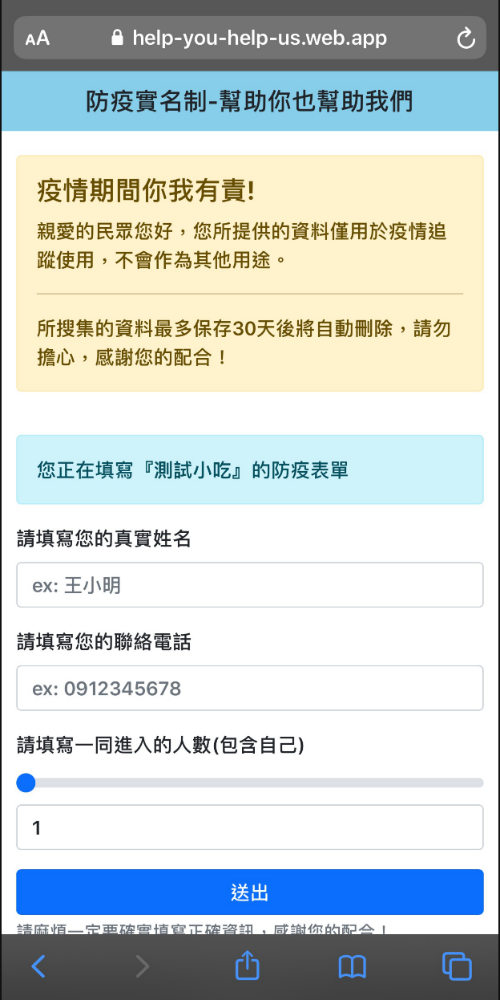
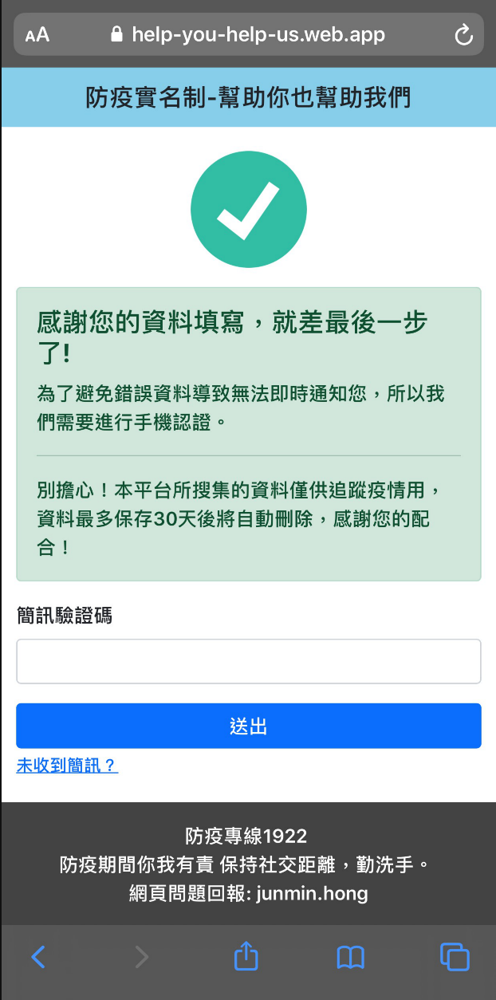
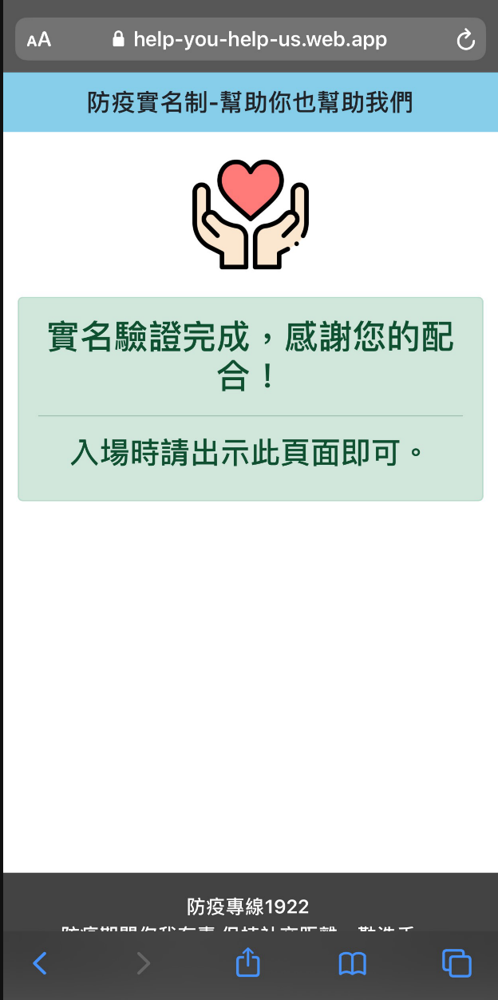
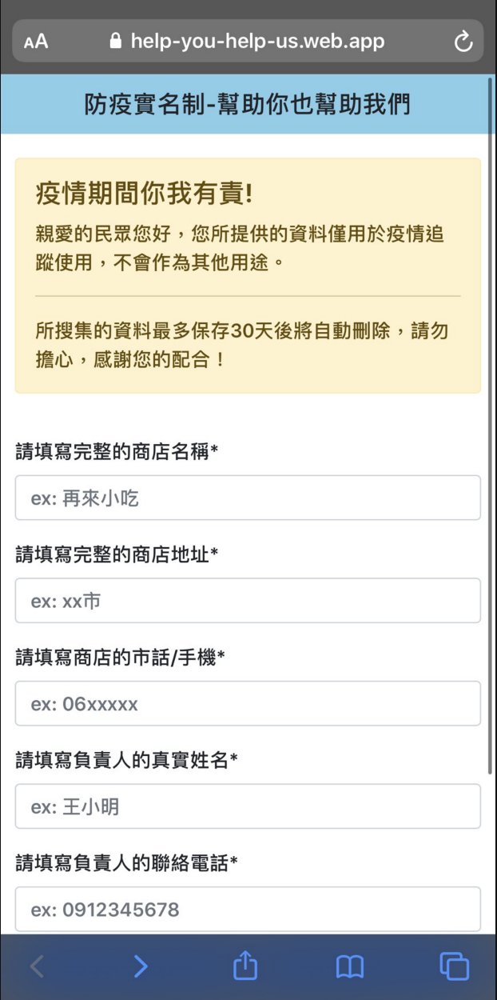
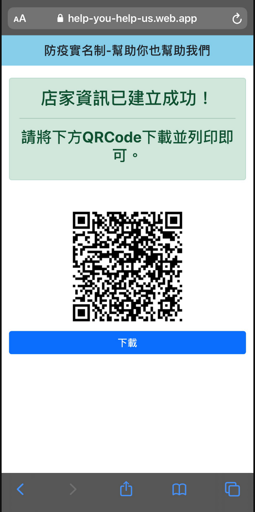

## What is this？
由於今年Covid19在台灣本土爆發，導致許多店家開始使用實名制的方式進行相關疫調工作。
但發現各地都產生許多實名制的亂象，為了改變並且簡化實名制，民眾不需要再輸入過多的個資。
於是我著手利用空閑時間進行開發這套經過簡訊實名制的系統。

## Demo Preview
### 客戶端 - 填寫表單

### 客戶端 - 簡訊認證畫面

### 客戶端 - 實名完成畫面

### 商店端 - 填寫表單

### 商店端 - 填寫完成並生成Qrcode

## 回顧開發中的經驗所談
1. 簡訊費用是一筆非常龐大的開銷。
2. 透過Qrcode的方式可以大幅降低填寫難度。